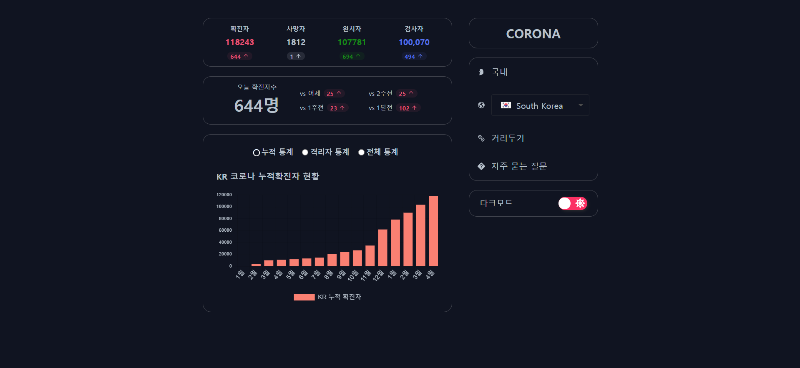
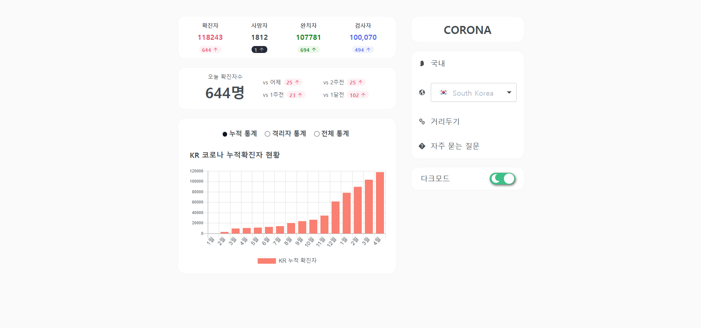

# Corona


```
React.js와 코로나 OpenAPI로 받은 데이터를 가공하여 각 나라별 현재 코로나현황을 Chart.js 그래프를 활용해
시각적으로 제공해주는 사이트입니다. 국내뿐만 아니라 해외의 코로나현황도 옵션에서 선택하여 볼 수 있습니다.
반응형으로 제작하였으며 Styled-Components를 사용하여 스타일링을 하였습니다.
또한 Styled-Components의 Theme-Provider를 활용하여 버튼을 토글하면 스타일이 전체적으로
다크모드, 라이트모드로 전환되도록 구현했습니다.
```

--------------------------------------------
### 페이지 미리보기
  #### Dark모드
  
  #### Light모드
  
--------------------------------------------

### 사용한 기술
```
- React.js
- Styled-components
- Theme-Provider
- Chart.js
- Axios
```

### portfolio site
https://ljh9506.github.io/corona/
